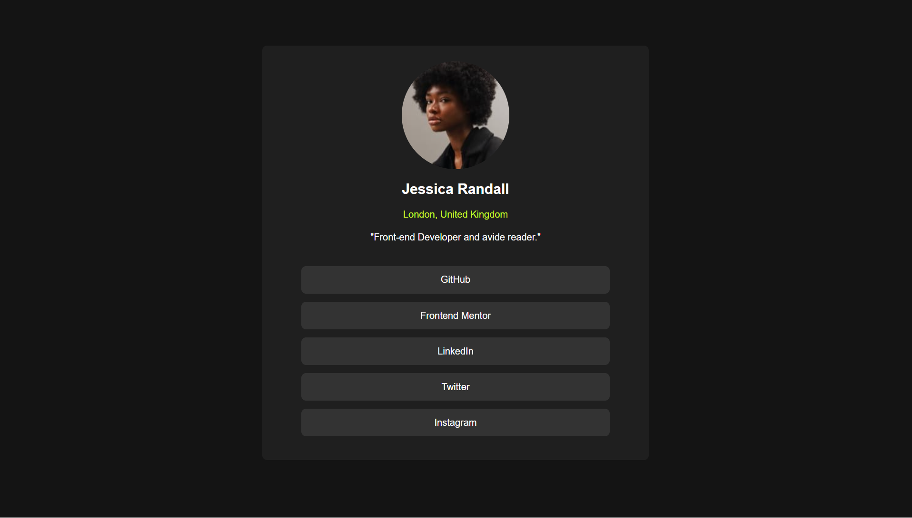

# Frontend Mentor - Social links profile solution

This is a solution to the [Social links profile challenge on Frontend Mentor](https://www.frontendmentor.io/challenges/social-links-profile-UG32l9m6dQ). Frontend Mentor challenges help you improve your coding skills by building realistic projects. 

## Table of contents

- [Overview](#overview)
  - [The challenge](#the-challenge)
  - [Screenshot](#screenshot)
  - [Links](#links)
- [My process](#my-process)
  - [Built with](#built-with)
  - [What I learned](#what-i-learned)
  - [Continued development](#continued-development)
  - [Useful resources](#useful-resources)
  - [AI Collaboration](#ai-collaboration)
- [Author](#author)
- [Acknowledgments](#acknowledgments)

**Note: Delete this note and update the table of contents based on what sections you keep.**

## Overview

### The challenge

Users should be able to:

- See hover and focus states for all interactive elements on the page

### Screenshot

### Links

- Solution URL: [Add solution URL here](https://your-solution-url.com)
- Live Site URL: [Add live site URL here](https://your-live-site-url.com)

## My process

### Built with

- Semantic HTML5 markup
- CSS custom properties
- Flexbox
- Mobile-first workflow

### What I learned

This challennge allowed me to review my knowledge of HTML and CSS and realise that I needed to put it into practice.

### Continued development

In future projetcs, I want to continue focusing on responsive design particularly mobile responsive design. I am open to any advice that would help me to become more familiar with these concepts.

### Useful resources

- [Responsive Viewer](https://chromewebstore.google.com/detail/responsive-viewer/inmopeiepgfljkpkidclfgbgbmfcennb?hl=en-US&utm_source=ext_sidebar) - It's a chrome extension that helps me  visualise different screen size for responsive design.

### AI Collaboration

I used ChatGPt to know what width and height to use for responsive design

**Note: Delete this note and the content above if you didn't use AI, or replace with your own experience.**

## Author

- Frontend Mentor - [@AllcodIn](https://www.frontendmentor.io/profile/AllcodIn)

